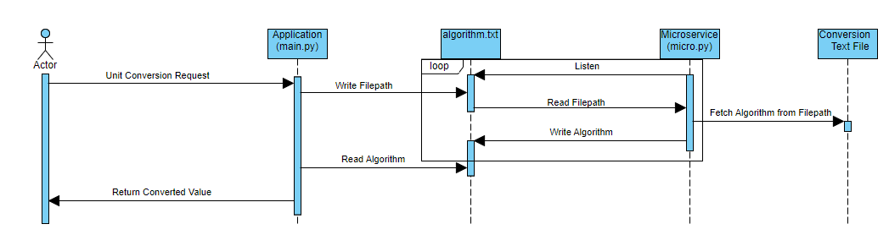

**CS361 Assignment 8 - Microservice**

1. Request

Enter filepath to unit conversion algorithm. In this example, it is done through direct text input. Write filepath to 'algorithm.txt.'

2. Retrieve

Read filepath from 'algorithm.txt.' Open file at filepath and read conversion factor. Write the conversion factor to 'algorithm.txt.'

3. UML Sequence Diagram

